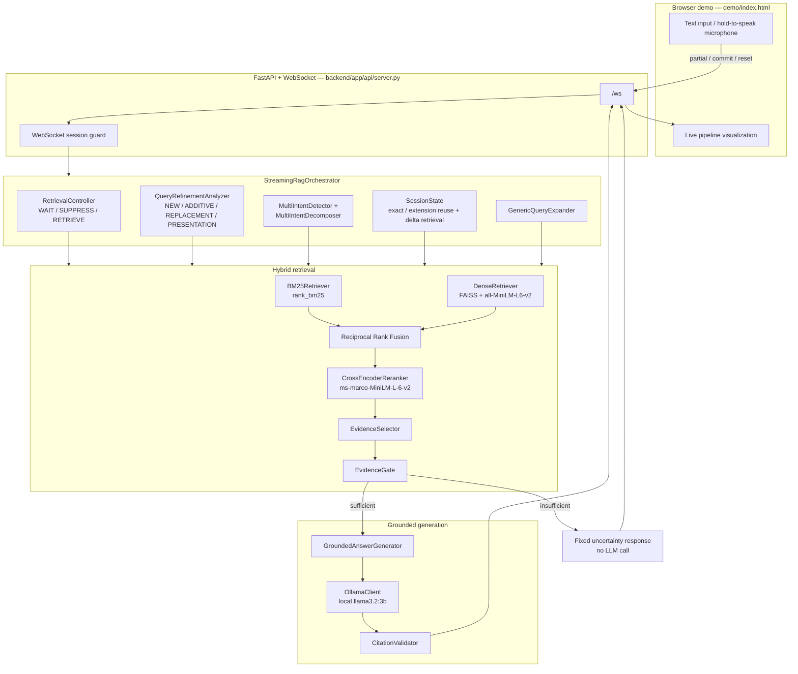

# Streaming-Live-RAG

> **Samsung PRISM GenAI Hackathon 2026 — Theme 04**

A Retrieval-Augmented Generation system for **live, streaming conversational input**. Instead of waiting for a finished question, the system can begin retrieval while a user is still speaking, then reuse or refine that evidence when the transcript is committed.

The implementation is **local-first and CPU-oriented**:

* **BM25 + Dense FAISS** hybrid retrieval
* **Reciprocal Rank Fusion (RRF)**
* Local **Sentence-Transformers CrossEncoder** reranking
* Local **Ollama** generation
* Evidence selection and sufficiency gating before generation
* Citation validation against supplied evidence
* Session/generation protection against stale streaming results
* Multi-intent decomposition and per-intent evidence handling
* Browser-based **Judge Mode** and **Conference Mode**
* Push-to-talk voice interaction using browser SpeechRecognition
* FastAPI WebSocket streaming between the browser and backend

The browser demo exposes the controller, retrieval, evidence, generation, and citation stages through a FastAPI WebSocket.

---

## 🏆 Hackathon Submission

**Theme:** Samsung PRISM GenAI Hackathon 2026 — Theme 04
**Project:** Streaming-Live-RAG

### Submission Contents

| Requirement        | Repository status              |
| ------------------ | ------------------------------ |
| Source code        | ✅ Included                     |
| `requirements.txt` | ✅ Included                     |
| Detailed README    | ✅ This file                    |
| Presentation / PPT | 📌 Included in repository root |
| Demo video         | 🎥 YouTube link provided below |
| Hackathon Git tag  | `PRISM_GENAI_HACKATHON_Y2026`  |

### 🎥 Demo Video

**5-minute final demonstration:**

> **TODO:** Replace this line with the actual unlisted YouTube URL.

`YouTube Demo: https://www.youtube.com/watch?v=Twsv_37PmaQ'

If the demo video is hosted externally because of file-size limitations, the repository README serves as the navigation point to the video.

### 📊 Presentation

The final hackathon presentation is included in the repository root:

```text
PRESENTATION.pptx
```

### 🔖 Submission Git Tag

The final submission commit is tagged:

```text
PRISM_GENAI_HACKATHON_Y2026
```

---

## Quick Start

### Requirements

* Python 3.11
* Ollama
* `llama3.2:3b`
* Windows/Linux/macOS
* A modern browser for the web demo

### Install

```powershell
python -m venv .venv
.\.venv\Scripts\Activate.ps1
python -m pip install -r requirements.txt
```

### Start Ollama

```powershell
ollama pull llama3.2:3b
```

Make sure Ollama is running before using answer generation.

### Start the application

```powershell
python -m uvicorn backend.app.api.server:app --host 0.0.0.0 --port 8000
```

Open:

```text
http://localhost:8000
```

The browser demo communicates with the FastAPI WebSocket endpoint:

```text
/ws
```

---

## What Makes This Different

Conventional RAG waits for:

```text
Complete Query
      ↓
   Retrieve
      ↓
    Rerank
      ↓
   Generate
      ↓
    Answer
```

Streaming-Live-RAG begins processing while the user is still speaking:

```text
Live Transcript
      ↓
WAIT / SUPPRESS / RETRIEVE
      ↓
Early Retrieval
      ↓
Evidence Reuse / Delta Retrieval
      ↓
Multi-Intent Handling
      ↓
Hybrid Retrieval
      ↓
RRF + CrossEncoder
      ↓
Evidence Selection + Gate
      ↓
Grounded Generation
      ↓
Citation Validation
      ↓
Streaming Answer
```

The core design goal is to reduce unnecessary waiting and unnecessary repeated retrieval while maintaining evidence-grounded answers.

---

## Project Context

This repository was developed for the **Samsung PRISM GenAI Hackathon 2026, Theme 04**.

The implementation focuses on streaming conversational RAG where the system must handle:

1. incomplete live transcripts;
2. early retrieval;
3. evidence reuse;
4. additive and replacement refinements;
5. multi-intent questions;
6. unsupported questions;
7. grounded generation;
8. citation validation;
9. stale streaming operations;
10. voice-based conference presentation.

> **Important:** Features described in this README correspond to the implementation currently committed to the repository. Architectural ideas that are not implemented are explicitly identified as future work.

## 1. Project Overview

Conventional RAG normally follows:

**complete query → retrieve → rerank → generate → answer**

Streaming-Live-RAG changes that flow for live transcripts:

- **Partial transcripts** are evaluated incrementally by a deterministic `RetrievalController`.
- The controller can **WAIT**, **SUPPRESS**, or start **RETRIEVE** early.
- Early retrieval results are stored in `SessionState` and can be reused when the final transcript is committed.
- Additive transcript extensions can trigger **delta retrieval** only when the new content is not already covered by existing evidence.
- Multi-intent questions are decomposed and retrieved per intent.
- Retrieved evidence passes through selection and sufficiency gating before generation.
- Generated citations are validated against the evidence actually supplied to the model.
- Session/generation IDs prevent stale retrieval or generation results from overwriting newer state or reaching a reset client.

The reference application is a FastAPI + WebSocket server with a single-page browser demo in `demo/index.html`.

---

## 2. Problem with Conventional RAG for Streaming / Live Queries

A conventional RAG pipeline assumes that the user provides one complete, static query. For live speech or incremental transcription, that creates several problems:

1. **Retrieval starts too late.** A complete retrieve → rerank → generate pipeline cannot begin until the user has finished speaking.
2. **Multiple intents can compete for one evidence budget.** A question containing two independent requests can be dominated by one topic.
3. **Presentation-only follow-ups do not need retrieval.** Requests such as “repeat that” or “make it shorter” can reuse the previous answer.
4. **Corrections and additions need different handling.** A correction can replace the previous query, while an additive continuation may only require retrieving the newly introduced topic.
5. **Streaming operations can become stale.** A later transcript or session reset must not allow an older in-flight operation to overwrite newer state.

---

## 3. Solution

`StreamingRagOrchestrator` coordinates a deterministic streaming controller with retrieval, evidence handling, grounded generation, and session protection.

| Challenge | Implemented mechanism |
|---|---|
| Retrieve before the user finishes | `RetrievalController` → `WAIT` / `SUPPRESS` / `RETRIEVE` |
| Reuse useful early retrieval | `SessionState.find_reusable_retrieval()` |
| Retrieve only meaningful transcript additions | `build_delta_query()`, `delta_needs_retrieval()`, `merge_evidence()` |
| Handle multiple intents | `MultiIntentDetector`, `MultiIntentDecomposer`, `MultiIntentRetriever` |
| Hybrid retrieval | BM25 + dense FAISS |
| Combine retrieval signals | Reciprocal Rank Fusion |
| Improve ordering | CrossEncoder reranking |
| Prevent weak evidence from reaching generation | `EvidenceSelector` + `EvidenceGate` |
| Handle broad document-level queries | `GenericQueryExpander` fallback |
| Ground generated answers | `GroundedAnswerGenerator` |
| Validate citations | `CitationValidator` |
| Prevent stale results | `SessionState` generation IDs + WebSocket session guard |

---

## 4. Architecture



---

## 5. Streaming Controller: WAIT / SUPPRESS / RETRIEVE

`backend/app/controller/retrieval_controller.py` implements `RetrievalController.decide()`.

It is **rule-based**, using regex and lexical heuristics rather than a trained classifier.

### `WAIT`

Used when the transcript does not yet contain enough stable information to retrieve, including:

- empty input;
- very short input;
- an incomplete non-final transcript ending in words such as `the`, `for`, `about`, `and`, `what`, etc.;
- insufficient query signal.

### `SUPPRESS`

Used for presentation-only follow-ups such as:

- “repeat”
- “say that again”
- “in two bullets”
- “make it shorter”
- “summarize that”
- “rephrase that”

The previous answer/citations can be surfaced without starting a new retrieval.

### `RETRIEVE`

Used when the controller detects enough signal for retrieval, including:

- explicit corrections/replacements;
- meaningful additive refinements;
- query-intent patterns combined with enough content words;
- sufficiently informative final transcripts.

Each decision carries a `reason` and `confidence` that the demo can display.

---

## 6. Early Retrieval and Evidence Reuse

When a partial transcript receives `RETRIEVE`, `StreamingRagOrchestrator.process_partial()` starts a new session generation and runs the normal retrieval path without invoking the LLM generator.

The accepted retrieval is stored in `SessionState` with its `generation_id`.

When the transcript is committed, the session can classify the relationship to the earlier retrieval as:

- **`exact`** — normalized query tokens are the same.
- **`extension`** — the earlier query is a qualifying prefix of the committed query.
- **`none`** — the earlier retrieval cannot safely be reused.

The extension check uses the implementation's minimum prefix requirements (`MIN_PREFIX_TOKENS = 5` and `MIN_PREFIX_COVERAGE = 0.6`) and is generation-guarded.

---

## 7. Delta Retrieval / Meaningful Transcript Extension

For a qualifying extension, the system can reuse the earlier evidence and inspect only the newly added transcript tail.

`backend/app/models/session.py` provides:

- `build_delta_query()` — removes leading connective words from the added tail.
- `delta_needs_retrieval()` — checks whether new content words are absent from the existing evidence.
- `merge_evidence()` — de-duplicates evidence by `chunk_id` when additional retrieval is required.

Therefore, an extension does not automatically mean another full retrieval call. Additional retrieval is performed only when the new content is not already covered by the reused evidence.

---

## 8. Multi-Intent Retrieval and Per-Intent Evidence

`backend/app/query/multi_intent.py` provides:

- `MultiIntentDetector` — identifies supported multi-intent patterns.
- `MultiIntentDecomposer` — splits them into `SubQuery` objects and can propagate a shared scope qualifier.

`MultiIntentRetriever` runs the single-query retrieval pipeline for each subquery concurrently using `asyncio.gather`.

The per-intent structure is preserved beyond retrieval:

1. `EvidenceSelector.select_per_intent()` selects evidence independently for each intent.
2. `EvidenceGate.check_per_intent()` checks support independently.
3. `GroundedAnswerGenerator._build_multi_intent_prompt()` creates a separate output section for each intent.
4. `CitationValidator.validate_multi_intent()` validates citations within the corresponding intent's evidence.

This prevents one well-supported intent from masking an unsupported second intent.

---

## 9. BM25 Retrieval

`backend/app/retrieval/bm25.py` implements `BM25Retriever`.

At startup it:

1. loads chunks using `chunk_loader.load_chunks`;
2. lowercases and whitespace-tokenizes chunk text;
3. builds an in-memory `rank_bm25.BM25Okapi` index.

`search(query, top_k)` returns ranked chunks with their BM25 score and rank.

---

## 10. Dense FAISS Retrieval

`backend/app/retrieval/dense.py` implements `DenseRetriever`.

The current implementation uses:

- Sentence-Transformers model: `sentence-transformers/all-MiniLM-L6-v2`
- `faiss.IndexFlatIP`
- L2-normalized embeddings

Because the vectors are normalized, the inner product is equivalent to cosine similarity for this retrieval use.

The dense index is built **in memory at startup** from the loaded corpus.

---

## 11. Reciprocal Rank Fusion

`backend/app/retrieval/fusion.py` implements `reciprocal_rank_fusion()`.

The BM25 and dense ranked lists are merged by summing:

```text
1 / (k + rank)
```

for each chunk appearing in either list. The implementation uses `k = 60` by default and returns the fused candidates ordered by fused score.

---

## 12. CrossEncoder Reranking

`backend/app/retrieval/reranker.py` implements `CrossEncoderReranker`.

The current model is:

```text
cross-encoder/ms-marco-MiniLM-L-6-v2
```

Each fused `(query, chunk_text)` pair is scored directly by the CrossEncoder. The resulting `reranker_score` determines the downstream evidence ordering used by the selector and gate.

---

## 13. Evidence Gate

`backend/app/retrieval/evidence_gate.py` implements `EvidenceGate`.

The gate checks whether retrieved evidence is sufficiently relevant and sufficiently specific to support an answer.

For the whole-query path it:

1. rejects empty evidence;
2. rejects a best reranker score below `0.0`, except for the supported retrieval-agreement fallback path;
3. applies the configured relevance floor;
4. performs an additional numeric-fact check for queries requesting values such as maximums, amounts, percentages, deadlines, or other numeric constraints;
5. returns a sufficiency decision, supporting chunk IDs, and a confidence value when the evidence is sufficient.

Multi-intent queries use `check_per_intent()` so each intent receives its own support decision.

If evidence is insufficient, the system emits the fixed uncertainty response instead of calling the LLM for that answer.

---

## 14. Evidence Selector

`backend/app/retrieval/evidence_selector.py` implements `EvidenceSelector`.

For the normal path it keeps a small evidence set using:

- `min_score = 0.5`
- `score_margin = 4.0`
- `max_chunks = 3`

It also verifies that selected chunks contain the required metadata:

`chunk_id`, `doc_id`, `section`, `text`, and `source`.

For multi-intent retrieval, selection is performed independently per intent. A retrieval-agreement recovery path can recover a candidate when BM25/Dense/RRF strongly agree but the CrossEncoder ranks it lower.

---

## 15. Generic-Query Fallback

`backend/app/query/generic_query_expander.py` implements `GenericQueryExpander`.

This fallback is used **after normal retrieval and evidence gating have rejected a query**. It is intended for broad whole-document questions where there may be no specific fact for the CrossEncoder to match.

The expander:

1. removes generic/question words;
2. keeps up to three topic tokens;
3. checks whether those topic tokens map unambiguously to one document;
4. selects an anchor chunk from that document;
5. adds the anchor section title and frequent corpus terms to the retrieval query.

The generated/refined query is used only for retrieval. The user's original question remains the question presented to evidence gating and generation.

---

## 16. Grounded Generation

`backend/app/llm/grounded_generator.py` implements `GroundedAnswerGenerator`.

The prompt supplies explicit evidence blocks using citation tags such as:

```text
[DOC_ID §Section]
```

The generator is instructed to:

- use only the supplied evidence;
- cite factual claims using the allowed evidence citations;
- not invent document IDs, sections, or numeric facts;
- use the fixed insufficiency sentence when evidence cannot answer the question.

The prompt also contains refinement-specific instructions for additive and replacement turns.

For multi-intent queries, the prompt contains one evidence/output section per intent and uses the fixed insufficiency text for unsupported intents.

Generation is available both as a complete response and as a token stream through `OllamaClient`.

---

## 17. Citation Validation

`backend/app/retrieval/citation_validator.py` implements `CitationValidator`.

It parses `[DOC_ID §Section]` citation blocks using the implementation's citation regex and compares them with citations that can actually be derived from the supplied evidence.

Key paths include:

- `validate()` — validates citations for a single-intent answer.
- `validate_multi_intent()` — validates citations within each intent.
- `attribute_sentences()` / `_attribute_body()` — associates answer sentences with their trailing citations.
- `enforce_unsupported_intents()` — checks that unsupported intents did not receive fabricated citations.

---

## 18. Session / Generation Stale-Result Protection

The implementation protects both internal state and the WebSocket client from stale work.

### Orchestration layer

`SessionState` maintains query/generation state. `start_new_query()` advances the query version and active generation ID.

`accept_results()` only stores retrieval results when the result's generation ID still matches the active generation. Stale results are reported as `retrieval_stale` rather than being accepted.

Reuse checks apply the same generation guard.

### WebSocket layer

`backend/app/api/server.py` maintains an active session ID for each WebSocket connection.

Outgoing messages are tagged with the active session and are dropped if a later `reset` has made that session stale. Partial/commit handling uses background `asyncio` tasks and per-session serialization so a reset is not blocked behind an in-flight commit.

---

## 19. Technology Stack

The stack is taken from `requirements.txt`, the Dockerfile, and the backend imports:

| Area | Technology |
|---|---|
| Runtime | Python 3.11 |
| API / transport | FastAPI, Uvicorn, WebSocket |
| Sparse retrieval | `rank-bm25` / `BM25Okapi` |
| Dense retrieval | FAISS CPU + Sentence-Transformers |
| Embedding model | `sentence-transformers/all-MiniLM-L6-v2` |
| Reranker | `cross-encoder/ms-marco-MiniLM-L-6-v2` |
| LLM | Local Ollama, default `llama3.2:3b` |
| PDF ingestion support | PyMuPDF |
| Data / schemas | NumPy, pandas, Pydantic |
| Configuration | python-dotenv |
| Frontend | Static HTML/CSS/JavaScript |
| Voice input/output | Browser SpeechRecognition API (input) + SpeechSynthesis API (answer playback) |
| Containerization | Docker + Docker Compose |

No frontend build system is required for the included demo.

---

## 20. Repository Structure

```text
.
├── backend/
│   ├── app/
│   │   ├── api/
│   │   │   └── server.py
│   │   ├── controller/
│   │   │   └── retrieval_controller.py
│   │   ├── ingestion/
│   │   │   ├── loader.py
│   │   │   └── chunker.py
│   │   ├── llm/
│   │   │   ├── ollama_client.py
│   │   │   └── grounded_generator.py
│   │   ├── models/
│   │   │   ├── session.py
│   │   │   ├── chunk.py
│   │   │   └── answer.py
│   │   ├── orchestration/
│   │   │   └── streaming_rag_orchestrator.py
│   │   ├── query/
│   │   │   ├── multi_intent.py
│   │   │   ├── refinement.py
│   │   │   ├── refinement_query_builder.py
│   │   │   ├── refinement_retriever.py
│   │   │   ├── generic_query_expander.py
│   │   │   └── session_answer_manager.py
│   │   └── retrieval/
│   │       ├── bm25.py
│   │       ├── dense.py
│   │       ├── fusion.py
│   │       ├── reranker.py
│   │       ├── streaming_retriever.py
│   │       ├── async_streaming_retriever.py
│   │       ├── multi_intent_retriever.py
│   │       ├── evidence_selector.py
│   │       ├── evidence_gate.py
│   │       ├── citation_validator.py
│   │       └── chunk_loader.py
│   └── tests/
│
├── data/
│   ├── raw/
│   ├── processed/
│   │   ├── chunks.jsonl
│   │   ├── phase6_chunks.jsonl
│   │   └── phase6_eval_queries.json
│   └── evaluation/
│
├── demo/
│   └── index.html
├── evaluation/
│   ├── eval_dataset.py
│   ├── fixtures.py
│   └── metrics.py
├── indexes/
│   ├── bm25/
│   └── faiss/
├── scripts/
│   ├── ingest.py
│   ├── simulate_stream.py
│   ├── evaluate_*.py
│   ├── benchmark_*.py
│   └── test_*.py
├── benchmark/
│   ├── model_comparison.md
│   └── model_comparison_report.md
├── Dockerfile
├── docker-compose.yml
└── requirements.txt
```

### Important current-path detail

The FastAPI server currently loads:

```text
data/processed/phase6_chunks.jsonl
```

from `backend/app/api/server.py`.

The standalone `scripts/ingest.py` writes:

```text
data/processed/chunks.jsonl
```

These are separate repository artifacts; the server's configured corpus is `phase6_chunks.jsonl`.

`backend/app/query/session_answer_manager.py` exists in the repository but is **not wired into** `StreamingRagOrchestrator` or `server.py`; it has its own test script.

---

## 21. Local Windows Setup

From the project root in PowerShell:

### 1. Create and activate a virtual environment

```powershell
python -m venv .venv
.\.venv\Scripts\Activate.ps1
```

If PowerShell blocks script execution, use the appropriate local PowerShell execution-policy configuration for your environment, or invoke the environment's Python executable directly:

```powershell
.\.venv\Scripts\python.exe -m pip install -r requirements.txt
```

### 2. Install dependencies

```powershell
python -m pip install -r requirements.txt
```

### 3. Ensure the processed corpus exists

The current FastAPI server expects:

```text
data/processed/phase6_chunks.jsonl
```

The repository already contains this file.

For the separate raw-document ingestion path, `scripts/ingest.py` generates:

```text
data/processed/chunks.jsonl
```

from `data/raw/`.

### 4. Start Ollama

See the next section.

### 5. Start the FastAPI demo

See §23.

---

## 22. Ollama Setup

The generation layer calls a local Ollama HTTP server.

Current defaults in `backend/app/llm/ollama_client.py`:

```text
Base URL: http://localhost:11434
Model:    llama3.2:3b
```

The base URL can be overridden with `OLLAMA_BASE_URL`.

Install Ollama, then pull the configured model:

```powershell
ollama pull llama3.2:3b
```

Make sure Ollama is running before using generation.

The repository also contains local model-comparison documentation in:

```text
benchmark/model_comparison.md
benchmark/model_comparison_report.md
```

Those files contain the project's recorded comparison material; no benchmark numbers are reproduced here.

---

## 23. FastAPI / Demo Startup

From the project root, with dependencies installed and Ollama available:

```powershell
python -m uvicorn backend.app.api.server:app --host 0.0.0.0 --port 8000
```

Then open:

```text
http://localhost:8000
```

The FastAPI application serves `demo/index.html`.

The browser communicates with:

```text
/ws
```

and can send `partial`, `commit`, and `reset` events. The UI visualizes controller decisions, retrieval, evidence, generation, and citations.

---

## 24. Docker Setup

The included `Dockerfile`:

- uses `python:3.11-slim`;
- installs `build-essential`;
- installs `requirements.txt`;
- copies `backend/`, `data/`, `demo/`, and `indexes/`;
- exposes port `8000`;
- starts:

```text
uvicorn backend.app.api.server:app --host 0.0.0.0 --port 8000
```

The included `docker-compose.yml` defines one service, `streaming-live-rag`.

It:

- maps host port `8000` to container port `8000`;
- sets `OLLAMA_BASE_URL=http://host.docker.internal:11434`;
- sets Hugging Face / Sentence-Transformers cache paths under `/root/.cache/huggingface`;
- persists that model cache through the `hf-cache` named volume;
- maps `host.docker.internal` to the host gateway.

Run:

```bash
docker compose up --build
```

**Ollama is not inside the container.** The Compose configuration expects Ollama to be running on the Docker host at the configured host address, with `llama3.2:3b` available.

---

## 25. Testing Scripts Actually Present

`backend/tests/` exists but is empty in this checkpoint.

The repository instead contains standalone scripts under `scripts/`. These exercise the real pipeline components and include deterministic assertions in several places.

### Evaluation / diagnostic scripts

```text
scripts/evaluate_early_retrieval.py
scripts/evaluate_g6_telemetry.py
scripts/evaluate_phase5.py
scripts/evaluate_session_refinement.py
scripts/debug_session_retrieval.py
scripts/generate_phase6_corpus.py
scripts/benchmark_models.py
scripts/benchmark_multi_intent_retrieval.py
scripts/simulate_stream.py
scripts/ingest.py
```

### Test scripts

```text
scripts/test_async_streaming.py
scripts/test_attribution.py
scripts/test_citation_validator.py
scripts/test_early_reuse.py
scripts/test_evidence_gate.py
scripts/test_g6_telemetry.py
scripts/test_generation_guard.py
scripts/test_generic_query_fallback.py
scripts/test_groundedness.py
scripts/test_grounded_generator.py
scripts/test_model_adversarial.py
scripts/test_model_benchmark.py
scripts/test_multi_intent_adversarial.py
scripts/test_multi_intent_answer.py
scripts/test_q016_e2e.py
scripts/test_q016_generation.py
scripts/test_q016_pipeline.py
scripts/test_refinement_retrieval.py
scripts/test_retrieval.py
scripts/test_session_answer_manager.py
scripts/test_streaming_controller.py
scripts/test_streaming_orchestrator.py
```

Example:

```powershell
python -m scripts.test_streaming_controller
```

Some scripts require the real Sentence-Transformers models, and generation-related scripts require a running local Ollama instance.

The repository also contains an `evaluation/` package with `eval_dataset.py`, `fixtures.py`, and `metrics.py`.

---

## 26. Live Voice / Conference Mode

`demo/index.html` adds a voice presentation layer (labelled `PHASE 8` in the source) on top of the same WebSocket `partial`/`commit` protocol the text-based Judge Mode panel already uses. It is a browser-only UI layer: it sends and receives the same messages, and does not add any new backend endpoint or bypass any pipeline stage.

### Push-to-talk flow

1. The user holds the microphone button (`btnMic`), which starts the browser's native `SpeechRecognition` (`window.SpeechRecognition` / `webkitSpeechRecognition`) API in continuous, interim-results mode.
2. While held, interim and final speech results are merged into a live transcript and shown in the transcript box.
3. Before being sent, the transcript is cleaned locally in the browser: filler words (`um`, `uh`, `like`, etc.) are stripped and immediate word repeats are collapsed. No LLM is involved in this cleanup step.
4. The cleaned text is throttled (roughly every 500 ms while it changes) and sent as a `partial` WebSocket event with `input_mode: "microphone"` — the same `partial` event type the Judge Mode transcript box sends, so it is evaluated by the existing `RetrievalController` (`WAIT` / `SUPPRESS` / `RETRIEVE`).
5. If the controller accepts an early retrieval for the current partial text while the button is still held (a `retrieval_update` event on the partial stream), the browser starts the answer immediately, using the exact text that was just retrieved for. The existing commit-time reuse logic then recognizes this as an exact match and does not re-retrieve. This can fire at most once per hold.
6. Releasing the microphone button stops speech recognition and finalizes/cleans the transcript. If that exact text was not already committed in step 5, it is sent through the normal `commit` path — the same path a manual "Ask" or the Judge Mode "Commit" button uses.
7. The grounded answer and its citations are displayed in the Conference Mode answer/citations panel as they stream in.
8. The browser's native `SpeechSynthesis` API can read the answer aloud (`Read Answer` / `Pause` / `Stop`); starting a new question always cancels any answer currently being spoken.
9. Voice- and session-related interactions are recorded as observational telemetry where implemented (see "Voice Telemetry" below).

The voice layer does **not** replace or bypass retrieval, evidence selection/gating, grounded generation, citation validation, or session/generation stale-result protection: partial and commit text from the microphone flows through `StreamingRagOrchestrator` exactly like typed text, because both input paths use the same `partial`/`commit` WebSocket messages and the same server-side handlers (`handle_partial` / `handle_commit`).

A lightweight, deterministic duplicate-question check (token-overlap/Jaccard similarity against session-local question history, no LLM) can offer to reuse a previous answer instead of re-asking; this runs entirely in the browser and does not affect retrieval.

---

## 27. Judge Mode vs Conference Mode

The demo has two UI modes, toggled from a single header button (`Judge Mode` / `Conference Mode`). The toggle only adds or removes a `conference-mode` class on the page `<body>`; both modes share one WebSocket connection, one session, and one backend pipeline (`StreamingRagOrchestrator` via `server.py`) — nothing in the toggle changes server-side behavior.

**Judge Mode** (technical/debug presentation) shows:

- the live pipeline stage indicator (transcript → intents → retrieve → evidence → generate → cited answer)
- the raw transcript box with `Commit` / `Send Partial` / `Reset` controls
- the three preset demo scenarios (A/B/C — see the next section)
- controller state: decision, reason, confidence
- retrieval observability: generation ID, query version, chunks retrieved, multi-intent flag, retrieval strategy, retrieval path (fresh vs. reused)
- per-intent cards, evidence cards, the grounded-answer/citations panel, and TTFT/LLM-latency/server-time metrics
- the system/stack panel and the live telemetry panel (session, turn, event, timestamp, token counts)

**Conference Mode** (clean live presentation, the default view) shows:

- the push-to-talk microphone button and live/editable transcript
- the grounded answer with citations, rendered in a larger presentation-friendly layout
- connection/session status
- a session-local question history with duplicate-question detection
- a reset control (`Reset session`)

Both modes observe the same underlying WebSocket event stream: the Conference Mode script wraps the existing `onEvent`/`handle` functions rather than duplicating them, so the clean and technical views are driven by identical orchestrator events and never diverge in what they represent.

### Reset behavior

Pressing reset (from either mode) sends a `reset` message to the server, which creates a fresh `SessionState` with a new session ID and a new per-session lock, and updates the single "active session" marker the server uses to gate outgoing messages. Any partial/commit turn still running against the previous session is left to finish on the server, but its output is dropped rather than sent to the client, because outgoing messages are tagged with the session they belong to and are only forwarded while that session is still the active one. On the client, a `reset_done` event fully resets the Conference Mode UI as well: it stops any in-progress speech recognition and speech synthesis, clears the transcript, answer, citation, and history panels, and returns the microphone/session status indicators to idle — so voice/session state cannot go stale after a reset.

---

## 28. Voice Telemetry

Client-reported voice events are sent as a separate `voice_event` WebSocket message type and logged by the server as additional, allow-listed G6 telemetry records — the same append-only JSON Lines mechanism described in "Session / Generation Stale-Result Protection" and "Observational telemetry" below. Voice events never reach `StreamingRagOrchestrator` and never influence retrieval, evidence handling, or generation; they are purely descriptive records of the browser's own microphone/TTS/session behavior.

The server allow-lists the following fields out of a client `voice_event` message (`backend/app/api/server.py`, `_VOICE_EVENT_FIELDS`):

| Field | Meaning |
|---|---|
| `input_mode` | `"microphone"` or `"text"` — also attached to normal commit-turn telemetry so a turn's input source is visible |
| `transcription_ms` | Duration of the speech-recognition hold, in milliseconds |
| `raw_transcript_length` | Character length of the raw (pre-cleanup) transcript — a count, not the transcript text itself |
| `final_transcript_length` | Character length of the cleaned, finalized transcript — likewise a count, not the text |
| `answer_spoken` | Boolean, set on speech-synthesis start/stop |
| `duplicate_detected` | Boolean result of the client-side duplicate-question check |
| `similarity_score` | Jaccard similarity score from that duplicate check |
| `mode` | Reserved allow-listed field for additional voice/session mode information |

Any other field on a `voice_event` message is dropped before logging. The event's own `event` name (e.g. `transcription_started`, `transcription_completed`, `voice_question_submitted`, `duplicate_detected`, `answer_speech_started`, `answer_speech_stopped`) is preserved as `voice_event_name`.

Consistent with the rest of the G6 telemetry path, raw transcript text and raw answer text are **not** stored — only their lengths and the scalar/boolean fields above. No additional privacy or security guarantees beyond this are implemented or claimed.

---

## 29. Judge-Friendly Demo Flow

The included browser demo has three preset scenarios, available as chip buttons (`demoA`/`demoB`/`demoC`) next to the transcript box in Judge Mode. They drive the transcript box directly and are not wired to the Conference Mode microphone; the equivalent live flow in Conference Mode is to hold the mic button and speak the question instead of clicking a preset.

### Demo A — Multi-intent

```text
What approval is needed for international travel and what documentation is needed for reimbursement?
```

This exercises multi-intent detection/decomposition, per-intent retrieval, per-intent evidence handling, and independently validated citations.

### Demo B — Partial → Commit

Partial:

```text
What approval is needed for international
```

Commit:

```text
What approval is needed for international travel?
```

This demonstrates early retrieval from a partial transcript followed by reuse of the earlier retrieval when the committed query is a qualifying extension.

### Demo C — Unsupported question

```text
What is the stock option vesting schedule for executives?
```

This exercises evidence insufficiency handling and the fixed uncertainty response rather than asking the LLM to invent an answer.

### Suggested 2–3 minute presentation order

1. **Show Demo B** — explain that retrieval can begin before the user finishes.
2. **Show the commit** — point out exact/extension reuse.
3. **Show Demo A** — explain independent intents and per-intent evidence/citations.
4. **Show Demo C** — demonstrate the evidence gate refusing unsupported content.
5. Briefly show the live pipeline visualization and architecture diagram.

---

## 30. Design Decisions

### Deterministic control plane

Controller, refinement analysis, multi-intent detection/decomposition, and generic-query expansion are implemented with deterministic regex/lexical logic rather than trained routing models.

### Hybrid retrieval

BM25 captures lexical matches while dense retrieval provides semantic similarity. RRF combines both signals before CrossEncoder reranking.

### Evidence before generation

The system deliberately places `EvidenceSelector` and `EvidenceGate` before the LLM. An insufficient evidence decision can return the fixed uncertainty response without an LLM call.

### Multi-intent as an end-to-end concern

Multi-intent handling is preserved through retrieval, selection, gating, prompting, and citation validation rather than being treated as only a query-splitting feature.

### Generation IDs as a safety mechanism

Generation/session bookkeeping protects against out-of-order partials, commits, and resets.

### Prompt grounding plus post-generation validation

The model receives an explicit evidence/citation allow-list, and the resulting citations are independently validated against that evidence.

### In-memory retrieval indexes

BM25 and FAISS indexes are constructed from the configured JSONL corpus at process startup. The repository's `indexes/` directories are copied into the Docker image but are not used as persisted retrieval indexes by the current retrieval classes.

### Observational telemetry

The server's G6 telemetry path is observational. Its allow-listed fields record IDs, counts, and scalar metrics rather than raw transcript/answer/evidence text.

---

## 31. Limitations

- BM25 and FAISS indexes are rebuilt in memory when the retrieval components are initialized; there is no implemented persisted-index loading path.
- `backend/tests/` is empty; verification is provided by standalone scripts under `scripts/`.
- Several test/evaluation scripts depend on real local models and, for generation paths, Ollama.
- Routing logic is deterministic and rule-based, so its behavior depends on the implemented lexical patterns and thresholds.
- The application is a single-process local server using one configured local Ollama model; the repository does not implement multi-tenant model routing or load balancing.
- Docker Compose does not bundle Ollama; it expects the model service on the Docker host.
- `session_answer_manager.py` is present but is not part of the live `StreamingRagOrchestrator` / FastAPI request path.
- The included corpus is policy-document data; behavior on substantially different domains is not established by the repository itself.

---

## 32. Future Work

The following are architectural directions, **not implemented features** in this checkpoint:

- Persist BM25/FAISS indexes so startup does not require rebuilding them.
- Add conventional, hermetic automated tests under `backend/tests/`.
- Add populated evaluation artifacts under `data/evaluation/`.
- Make routing thresholds configurable or replace selected deterministic routing components with learned approaches for broader domains.

---

## 33. Submission Verification

Before submitting the GitHub repository, verify the following:

```text
✓ Source code pushed
✓ requirements.txt present
✓ Detailed README present
✓ Final PPT present in repository
✓ Demo video link present in README
✓ Final changes committed
✓ Final changes pushed to main
✓ PRISM_GENAI_HACKATHON_Y2026 tag created
✓ Tag pushed to GitHub
```

The GitHub repository submitted in the hackathon form should point to the final repository containing these artifacts.

---

## 34. License

No `LICENSE` file is present in the repository, so this README does not declare a license.
